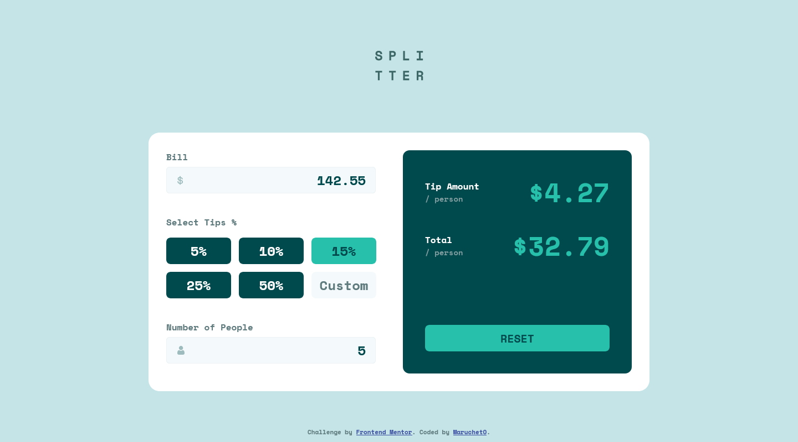

# Frontend Mentor - Tip calculator app solution

This is a solution to the [Tip calculator app challenge on Frontend Mentor](https://www.frontendmentor.io/challenges/tip-calculator-app-ugJNGbJUX). Frontend Mentor challenges help you improve your coding skills by building realistic projects.

## Table of contents

- [Overview](#overview)
  - [The challenge](#the-challenge)
  - [Screenshot](#screenshot)
  - [Links](#links)
- [My process](#my-process)
  - [Built with](#built-with)
  - [What I learned](#what-i-learned)
  - [Continued development](#continued-development)
  - [Useful resources](#useful-resources)
- [Author](#author)

## Overview

### The challenge

Users should be able to:

- View the optimal layout for the app depending on their device's screen size
- See hover states for all interactive elements on the page
- Calculate the correct tip and total cost of the bill per person

### Screenshot



### Links

- Solution URL: [Add solution URL here](https://your-solution-url.com)
- Live Site URL: [https://marucheto.github.io/Tip-calculator-app/](https://marucheto.github.io/Tip-calculator-app/)

## My process

### Built with

- Semantic HTML5 markup
- CSS custom properties
- Flexbox
- CSS Grid
- Mobile-first workflow

### What I learned

```html
<h1>Some HTML code I'm proud of</h1>
```
```css
/* Hide Arrows From Input Number - https://www.w3schools.com/howto/howto_css_hide_arrow_number.asp */
/* Chrome, Safari, Edge, Opera */
input::-webkit-outer-spin-button,
input::-webkit-inner-spin-button {
  -webkit-appearance: none;
  margin: 0;
}
/* Firefox */
input[type="number"] {
  -moz-appearance: textfield;
}
```
```js
// toFixed but flooring - https://quickref.me/truncate-a-number-to-a-given-number-of-decimal-places-without-rounding.html
const toFixed = (n, fixed) =>
    `${n}`.match(new RegExp(`^-?\\d+(?:\.\\d{0,${fixed}})?`))[0];

toFixed(cal, 2)
```

If you want more help with writing markdown, we'd recommend checking out [The Markdown Guide](https://www.markdownguide.org/) to learn more.

### Continued development

Use this section to outline areas that you want to continue focusing on in future projects. These could be concepts you're still not completely comfortable with or techniques you found useful that you want to refine and perfect.

### Useful resources

- [Hide Arrows From Input Number](https://www.w3schools.com/howto/howto_css_hide_arrow_number.asp)
- [toFixed with flooring (not rounding)](https://quickref.me/truncate-a-number-to-a-given-number-of-decimal-places-without-rounding.html)

## Author

- Frontend Mentor - [@MaruchetO](https://www.frontendmentor.io/profile/MaruchetO)
